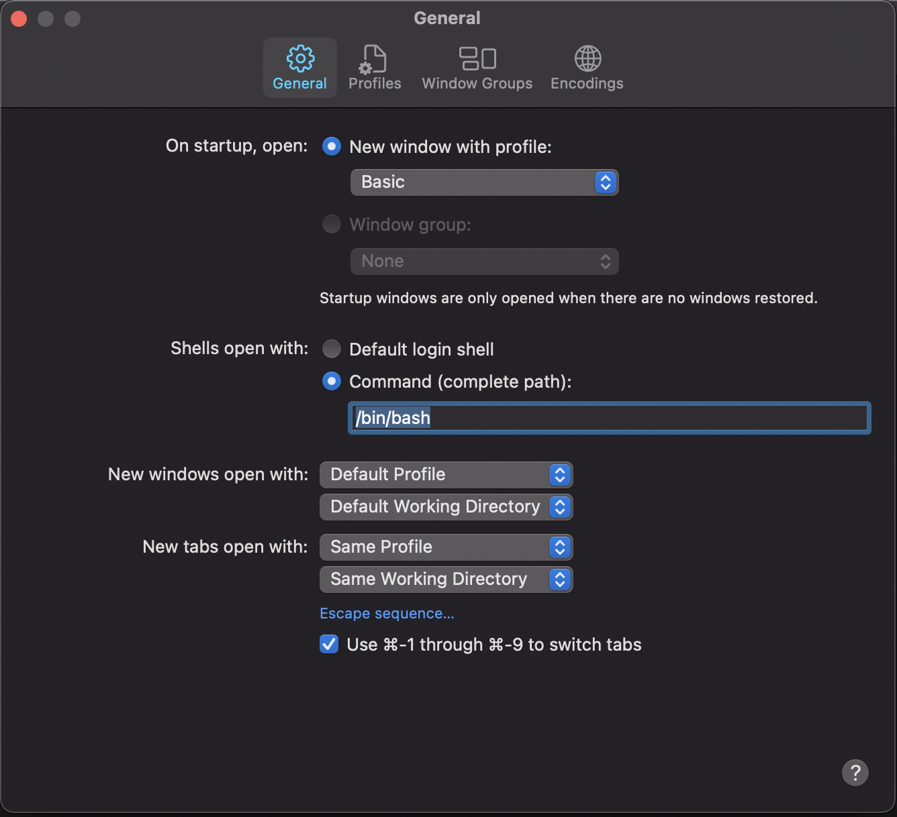

# Share Development Environments
Align development environment among machines | developers.
- Reduce time for setting up the environment when we change to a new machine 🚀
- Standardize commands for the development team 🙌
- Talk the same language in commands for team members 🙆
- Contribute to help your brain quick remember and prevent bad memory 🙏 

## Supported modules
- Common variable environments, required tools for macOS
- Common commands for CLI Tools in centralized management
- Common commands for Android
- Common commands for iOS
- Common commands for React Native
- Common commands for Public Key Infrastructure
  - Common commands for SSH (Secure Shell)
  - Common commands for GPG (GNU Privacy Guard) sign your commit or message
- Common commands for MongoDB


## OS support
- macOS only: 
  - Bash: 
    - Version: `4.0+` Apple's default version `3.2+` due to license concerns that we [need to upgrade bash](https://www.shell-tips.com/mac/upgrade-bash/)

## How to setup
1. Download the setup run script: ``` curl -O https://raw.githubusercontent.com/make-everything-simple/share-dev-environments/master/MacOS/setup ```
2. Grant the execute permission to the script: ``` chmod +x ./setup ```
3. Execute the script: ``` ./setup ```
4. Config bash use with terminal
   - Run the command for each new session `exec bash`
   - Config once as the following:
     - Terminal's command default: 
     - Terminal's startup command: 

`Noted`: 
- This script needs the admin permission to execute.
- Make sure file `$HOME/.bash_profile` already existed before we execture. If It does not exist just create `touch $HOME/.bash_profile` and make sure permission `-rw-r--r--` to file. Run the command `chmod 644 $HOME/.bash_profile` if it does not sastify permission

## How to use
- Each module support two basic commands
  - `module_help`: overview utility supported commands on this module
  - `module_tools`: overview common tools on this module

| Module        | Help         | Tools           |
| ------------- |:------------:| :---------------:|
| Base          |  `base_help` |  `base_tools`   |
| CLI           |  `cli_help`  |  `cli_tools`    |
| Android       |`android_help`| `android_tools` |
| iOS           |  `ios_help`  |   `ios_tools`   |
| React Native  |  `rn_help`   |   `rn_tools`    |
| Public Key Infrastructures | `pki_help` |    `pki_tools` |
| MongoDB       | `mongo_help` | `mongo_tools`   |
- ```$ simple ```: entry command for all supported commands

## Contributors
- Follow Style Guide: [Shell](https://google.github.io/styleguide/shell.xml)